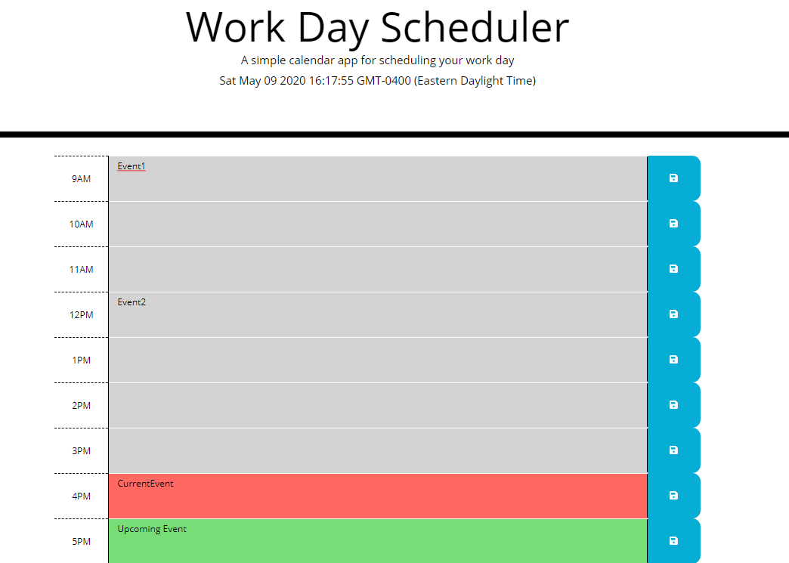

# Day Planner

A simple day planner application that allows the user to schedule out their day. Current time blocks appear red, past time blocks are colored grey, and future time blocks are colored green. The input is also saved to local storage so that it is persistent on the page for the user.

## Table of Contents
-[Installation](#installation)

-[Usage](#usage)

-[Credits](#credits)

## Installation:

**How to install the project:** Clone the repository and open the application in your browser.

## Usage:

For people who want to keep track of their schedule during the day.

## Credits:

**Credits to contributors:** N/A